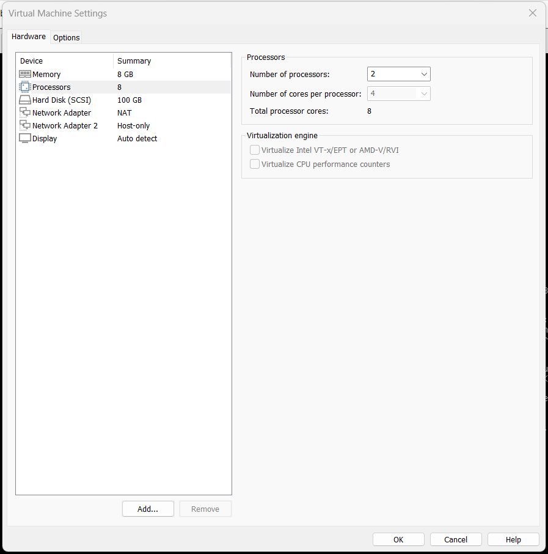

# Projek PNETLAB

## Konfigurasi

### Resource
[Download](https://pnetlab.com/pages/download){ .md-button .md-button--primary }

### 1. Interfaces
#### - Masukan file pnetlab kedalam vmware
#### - Mengatur settingan pnetlab menjadi seperti ini :

#### - Setelah menyetting nyalakan pnetlab
#### - Setelah nyala, masuk ke pnetlab sebagai root user, masukkan password pnet
#### - nanti akan masuk kedalam pnetlab
#### - Isi semua data kecuali ipnya
#### - masuk ke link
```http://192.168.222.159/store/public/admin/main/view```
#### - Jika layar seperti ini

#### - masuk sebagai admin dan password pnet
### 2. Setting Ishare
#### - masukkan link ini ke pnet lab
```wget -O /usr/sbin/ishare2 https://raw.githubusercontent.com/pnetlabrepo/ishare2/main/ishare2 > /dev/null 2>&1 && chmod +x /usr/sbin/ishare2 && ishare2```
#### - Masuk ke puty
#### - Masukkan ip 
```192.168.222.159```
#### - mencari router mikrotik
```ishare2 search mikrotik```
#### - Menarik mikrotik nomer 604
```ishare2 pull qemu 604``
#### - cek dengan melakukan test membikin lab baru di pnetlab
#### - masukkan node lalu cek mikrotik
#### - mencari router cisco
#### - ishare2 search iol
#### - ishare2 pull qemu 17
#### - masukkan node lalu cek cisco

###  3. Fix permission

### 4. Add router OS

